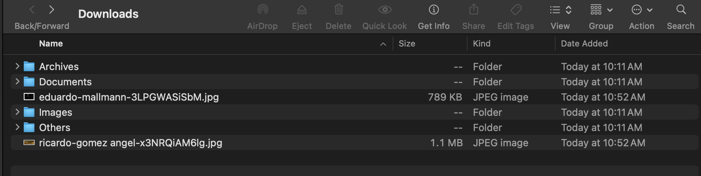
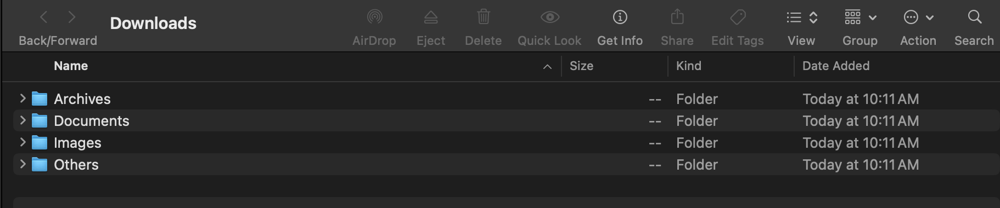

# File Organizer

A beginner-friendly Python script that automatically organizes files in a folder into subfolders based on file type.  
Useful for cleaning up cluttered directories like **Downloads**.

---


## 🚀 Features

- Organizes files into folders: Images, Documents, Videos, Audio, Archives, and Others.
- Automatically creates folders if they don't exist.
- Works on macOS, Windows, and Linux.
- Beginner-friendly and easy to customize.

## Description
Organizes files in a specified directory into folders based on file type (e.g., images, videos, docs).

## 🖥️ Example

### Before


### After


---

## How to Use
- Set the path in `file_organizer.py` to your folder (like Downloads)
- Run the script
- Files will move to folders like `Images/`, `Documents/`, `Others/`, etc.

## ⚡ Usage
**Clone the repository:**
```bash
git clone git@github.com:alphatushar/file-organizer.git
```

---

## Author
Tushar Sharma